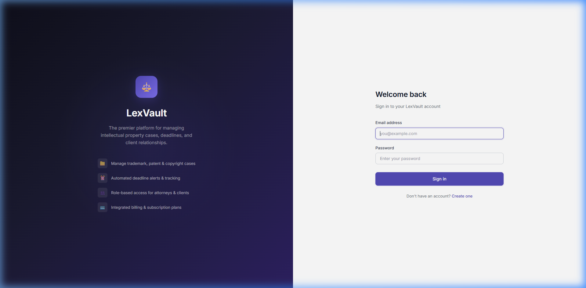
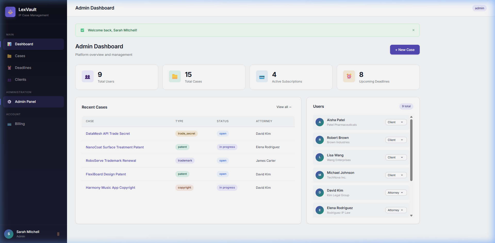
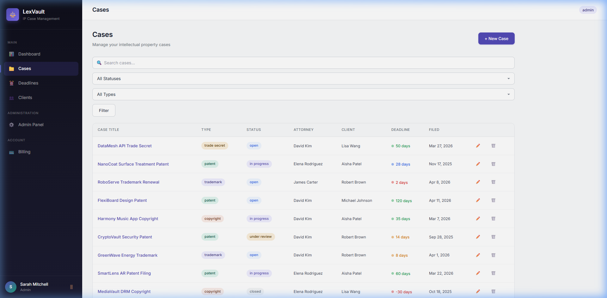
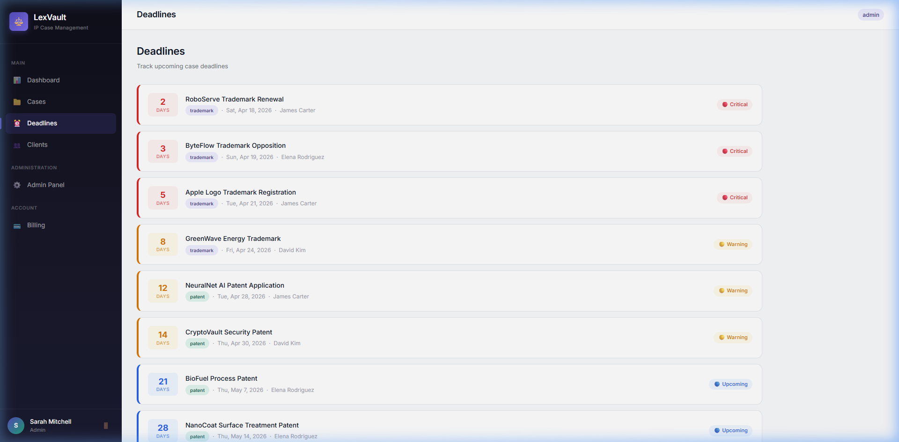
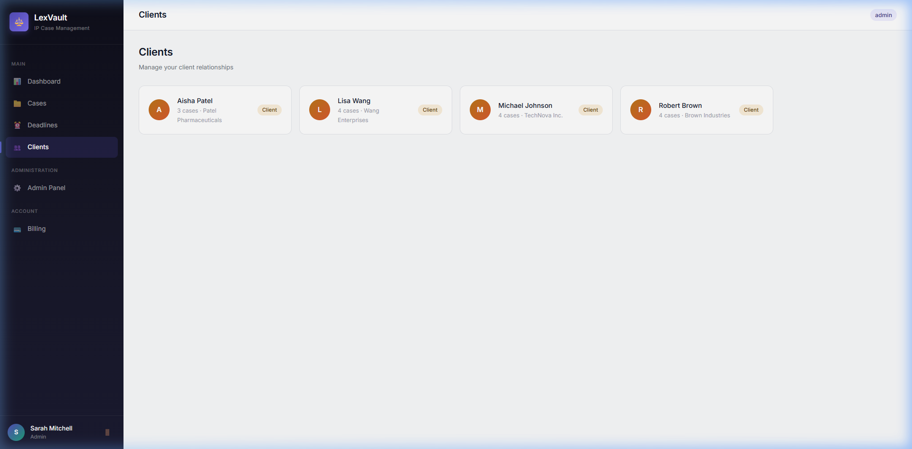
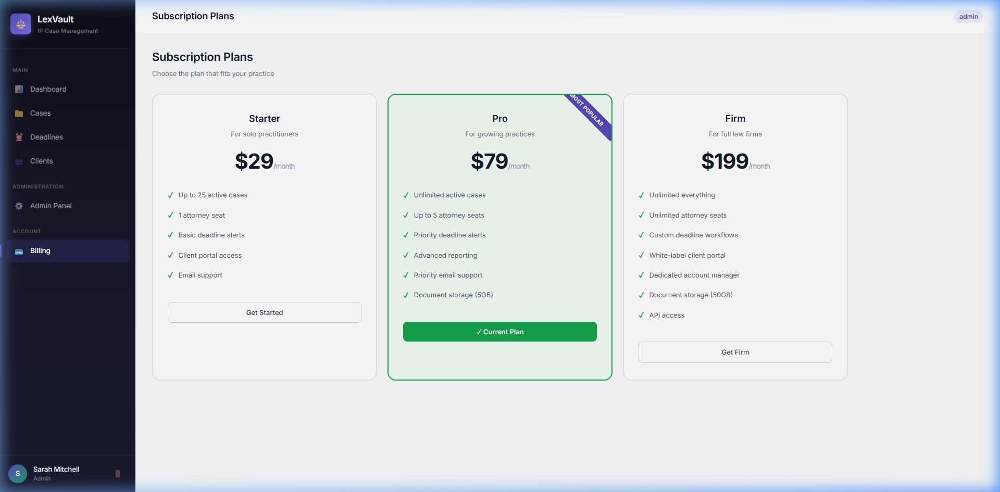

# ⚖️ LexVault — IP Case Management Platform

A full-featured intellectual property case management platform built with Node.js, Express, EJS, Supabase, and Stripe.



## Features

- **Role-Based Access** — Admin, Attorney, and Client dashboards with distinct permissions
- **Case Management** — Full CRUD for trademark, patent, copyright, and trade secret cases
- **Deadline Engine** — Automated tracking with cron-based email alerts at 30/14/7 day thresholds
- **Client Portal** — Read-only case access for clients with status updates
- **Stripe Billing** — Subscription plans (Starter/Pro/Firm) with webhook handling
- **Premium UI** — Dark sidebar, stat cards, urgency indicators, responsive design

## 📸 Screenshots

### Admin Dashboard


### Case Management


### Deadlines Tracking


### Client Management


### Subscription Plans


## 🚀 Quick Start Guide

### 1. Prerequisites
- Node.js installed
- Supabase account (free tier works perfectly)
- Stripe account (optional for billing features)

### 2. Setup Project
Clone the repository and install dependencies:
```bash
git clone <repo-url>
cd lexvault
npm install
```

### 3. Environment Variables
Create a `.env` file in the root directory (you can copy from `.env.example`):
```env
# Server
PORT=3000
NODE_ENV=development

# Session
SESSION_SECRET=lexvault-dev-secret-change-in-production

# Supabase — Replace with your actual credentials
SUPABASE_URL=https://your-project.supabase.co
SUPABASE_ANON_KEY=your-anon-key
SUPABASE_SERVICE_KEY=your-service-role-key

# Stripe (optional — leave empty to disable billing)
STRIPE_SECRET_KEY=
STRIPE_WEBHOOK_SECRET=
STRIPE_STARTER_PRICE_ID=
STRIPE_PRO_PRICE_ID=
STRIPE_FIRM_PRICE_ID=

# SMTP (optional — falls back to console logging)
SMTP_HOST=smtp.gmail.com
SMTP_PORT=587
SMTP_USER=your-email@gmail.com
SMTP_PASS=your-app-password
SMTP_FROM=noreply@lexvault.com
```

### 4. Database Setup
1. Go to your Supabase project → **SQL Editor**
2. Paste and run the contents of `supabase/schema.sql` to create all tables and RLS policies.

### 5. Start the Application
Start the development server:
```bash
npm run dev
```

Navigate to `http://localhost:3000` in your browser.

## 🔐 Sample Test Account

You can use the following test account credentials to log in and explore the admin dashboard:

- **Email:** `muhammadshah4589@gmail.com`
- **Password:** `muhammadshah4589@gmail.com`

> **Note:** Make sure you register an account with this email/password first. By default, the **first user** to register automatically becomes the platform **Admin**.

*(Alternatively, you can run `node src/seed.js` to automatically populate the database with dummy cases, attorneys, and clients).*

## Tech Stack

| Layer | Technology |
|-------|-----------|
| Backend | Node.js + Express |
| Views | EJS + express-ejs-layouts |
| Database | Supabase (PostgreSQL + Auth) |
| Payments | Stripe (Subscriptions) |
| Email | Nodemailer |
| Cron | node-cron |

## License

ISC
